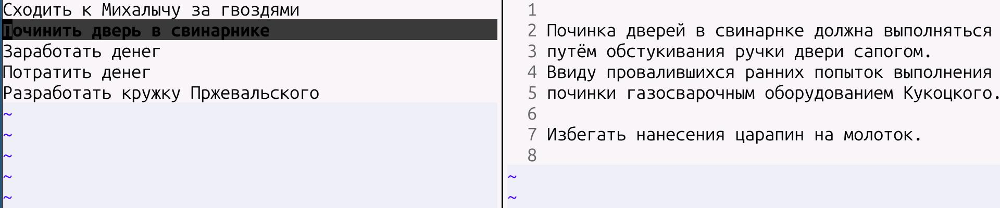

# Что это

Простой TODO-плагин для nvim с хранением информации в локальных файлах.



# Установка

## Lazy
Бахнуть это в ~/.config/nvim/init.lua в секцию перечисления Lazy-плагинов:
```
{
  "pavelkolodin/planning.nvim",
  cmd = { "Planning", "PlanAdd", "PlanUp", "PlanDown", "PlanDel" },
  config = function()
    require("planning").setup()
  end,
}
```

Запустите nvim. Оно должно провернуть шестерни само. Или руками `:Lazy` и там поройтесь. Потом можно перезапустить для чистоты опыта. Позже надо будет сделать под не-Lazy что-нибудь.

# Как начать

```
mkdir todofolder
nvim
:Planning
```
Теперь каталог todofolder является организованным список дел.


# Как работать
1. Создайте дела, которые вам нужно сделать:
- `:PlanAdd Починить дверь в ванной`
- `:PlanAdd Сходить в озон за плоскогубцами`
- `:PlanAdd Задуматься о промокаемости гипербытиёвности`
2. Слева список дел. Вверх/вниз/j/k - перемещение между делами.
3. Справа подробности текущего дела - это текстовый файл, сохраняйте его как обычно :w
4. :PlanUp (q) или :PlanDown (z) - двигать текущее дело по стеку дел вверх или вниз.
5. :PlanDel (x) - удалить дело
6. Манипуляции PlanAdd, PlanUp, PlanDown, PlanDel сохранять не надо, они сразу пишутся в файл INDEX.planning. Удалённые дела не удаляются, а переносятся в TRASH.planning - мало ли чего.


# Принцип работы

1. Файл `INDEX.planning` своим наличием делает из данного каталога "список дел". Этот файл на одной строке хранит "дело", каждое "дело" в формате `<filename> <description>`, порядок строк задаёт порядок (приоритет) дел.
2. Команды :PlanUp, :PlanDown просто двигают строки в файле INDEX.planning
3. `<filename>` - это имя файла в подкаталоге records, `<description>` - описание пункта TODO, например "починить дверь".
4. Имена файлов `<filename>` придумываются рандомно в момент PlanAdd.

# Удобно бекапить.

1. Заархивируйте todofolder и готово: `tar -czvf todofolder-2026-09-15.tar.gz todofolder`.

# Markdown, картинки, время исполнения задач.

Эталонное ненужно. И так зашибись.

